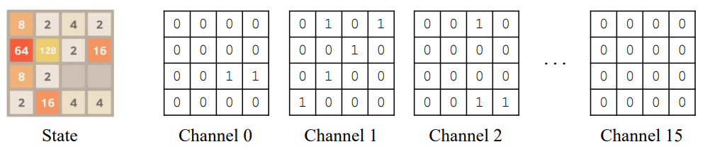
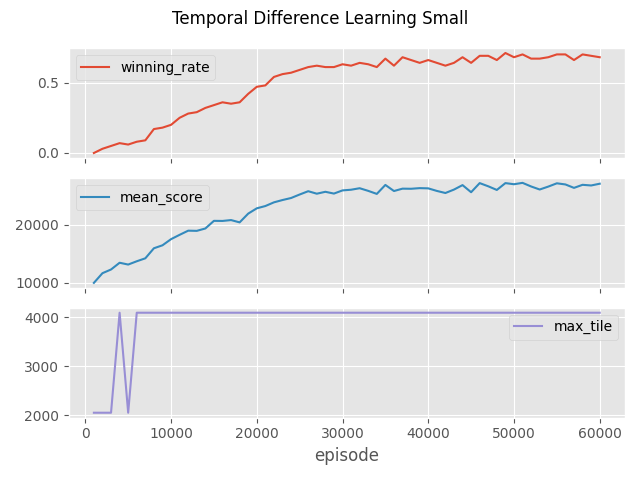
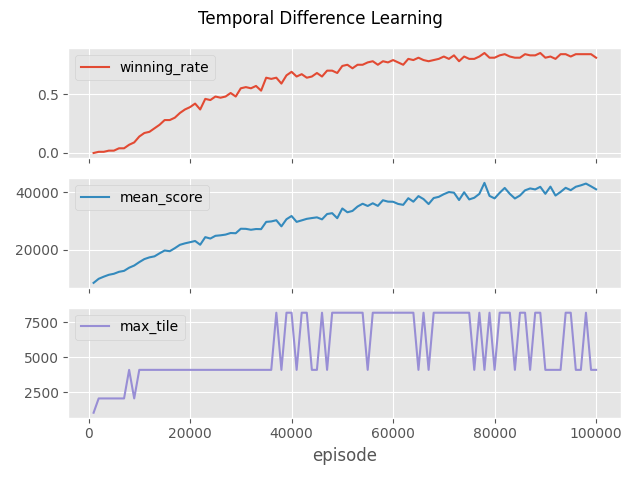
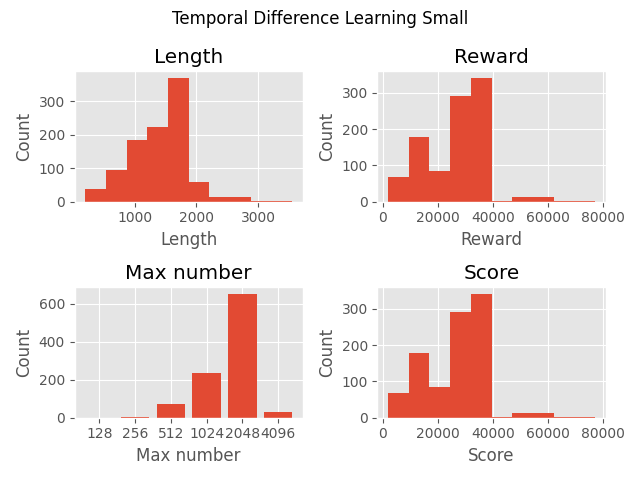
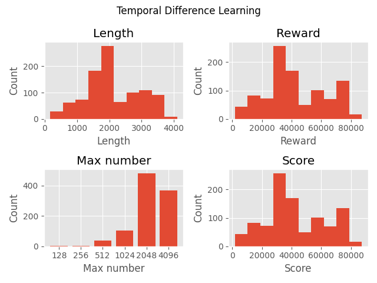
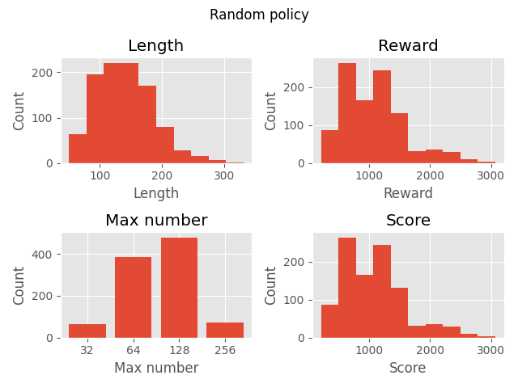

# Gymnasium 2048

[](https://github.com/Quentin18/gymnasium-2048/actions/workflows/build.yml)
[](https://badge.fury.io/py/gymnasium-2048)
[](https://badge.fury.io/py/gymnasium-2048)
[](https://pepy.tech/projects/gymnasium-2048)
[](https://pre-commit.com/)
[](https://github.com/psf/black)
[](https://pycqa.github.io/isort/)

Gymnasium environment for the [Game 2048](https://en.wikipedia.org/wiki/2048_(video_game)) and game-playing agents using
temporal difference learning of n-tuple networks.

https://github.com/Quentin18/gymnasium-2048/assets/58831477/c630a605-d1da-412a-a284-75f5c28bab46

<table>
    <tbody>
        <tr>
            <td>Action Space</td>
            <td><code>spaces.Discrete(4)</code></td>
        </tr>
        <tr>
            <td>Observation Space</td>
            <td><code>spaces.Box(low=0, high=1, shape=(4, 4, 16), dtype=np.uint8)</code></td>
        </tr>
        <tr>
            <td>Import</td>
            <td><code>gymnasium.make("gymnasium_2048:gymnasium_2048/TwentyFortyEight-v0")</code></td>
        </tr>
    </tbody>
</table>

## Installation

To install `gymnasium-2048` with pip, execute:

```bash
pip install gymnasium_2048
```

From source:

```bash
git clone https://github.com/Quentin18/gymnasium-2048
cd gymnasium-2048/
pip install -e .
```

## Environment

### Action Space

The action is an integer representing the direction to slide the tiles:

| Direction | Action |
|-----------|--------|
| 0         | UP     |
| 1         | RIGHT  |
| 2         | DOWN   |
| 3         | LEFT   |

### Observation Space

The observation is a 3D `ndarray` encoding the board state. It is encoded into 16 channels, where each channel is a 4x4
binary image. The i-th channel marks each cell of the game position that contains the i-th tile as 1, and 0 otherwise.
Each channel represents the positions of empty cells, 2-tiles, 4-tiles, ... , and 32768-tiles, respectively.



This representation is mostly used for deep convolutional neural networks (DCNN).

### Rewards

At each step, for each tile merge, the player gains a reward
equal to the value of the new tile.
The total reward, corresponding to the game score, is the
sum of rewards obtained throughout the game.

### Starting State

The game starts with two randomly generated tiles. A 2-tile can be generated with probability 0.9 and a 4-tile with
probability 0.1.

### Episode End

The episode ends if there are no legal moves, i.e., all squares are occupied and there are no two adjacent tiles sharing
the same value.

### Arguments

- `size`: the size of the game board. The default value is 4.
- `max_pow`: the maximum power of 2 allowed. The default value is 16.

```python
import gymnasium as gym

gym.make("gymnasium_2048:gymnasium_2048/TwentyFortyEight-v0", size=4, max_pow=16)
```

## Usage

To use the training and evaluation scripts, install the `training` dependencies:

```bash
pip install .[training]
```

### Play Manually

To play the game manually with the four arrows of your keyboard, execute:

```bash
python -m scripts.play
```

See the arguments with the help command:

```bash
python -m scripts.play -h
```

### Train an Agent

To train an agent using temporal difference learning of n-tuple networks, execute:

```bash
python -m scripts.train \
  --algo tdl \
  -n 100000 \
  --eval-freq 5000 \
  --eval-episode 1000 \
  --save-freq 5000 \
  --seed 42 \
  -o models/tdl
```

See the arguments with the help command:

```bash
python -m scripts.train -h
```

### Plot Training Metrics

To plot training metrics from logs, execute:

```bash
python -m scripts.plot \
  -i train.log \
  -t "Temporal Difference Learning" \
  -o figures/training_tdl.png
```

See the arguments with the help command:

```bash
python -m scripts.plot -h
```

Here are the training metrics of trained policies over episodes:

| TDL small                                      | TDL                                |
|------------------------------------------------|------------------------------------|
|  |  |

### Enjoy a Trained Agent

To see a trained agent in action, execute:

```bash
python -m scripts.enjoy \
  --algo tdl \
  -i models/tdl/best_n_tuple_network_policy.zip \
  -n 1 \
  --seed 42
```

See the arguments with the help command:

```bash
python -m scripts.enjoy -h
```

### Evaluate a Trained Agent

To evaluate the performance of a trained agent, execute:

```bash
python -m scripts.evaluate \
  --algo tdl \
  -i models/tdl/best_n_tuple_network_policy.zip \
  -n 1000 \
  --seed 42 \
  -t "Temporal Difference Learning" \
  -o figures/stats_tdl.png
```

See the arguments with the help command:

```bash
python -m scripts.evaluate -h
```

Here are the performances of trained policies:

| TDL small                                   | TDL                             |
|---------------------------------------------|---------------------------------|
|  |  |

<details>
<summary>Random policy performances</summary>



</details>

## Tests

To run tests, execute:

```bash
pytest
```

## Citing

To cite the repository in publications:

```bibtex
@misc{gymnasium-2048,
  author = {Quentin Deschamps},
  title = {Gymnasium 2048},
  year = {2023},
  publisher = {GitHub},
  journal = {GitHub repository},
  howpublished = {\url{https://github.com/Quentin18/gymnasium-2048}},
}
```

## References

- [Gymnasium](https://github.com/Farama-Foundation/Gymnasium)
- [Szubert and Jaśkowski: Temporal Difference Learning of N-Tuple Networks
  for the Game 2048](https://www.cs.put.poznan.pl/wjaskowski/pub/papers/Szubert2014_2048.pdf)
- [Guei and Wu: On Reinforcement Learning for the Game of 2048](https://arxiv.org/pdf/2212.11087.pdf)

## Author

[Quentin Deschamps](mailto:quentindeschamps18@gmail.com)
